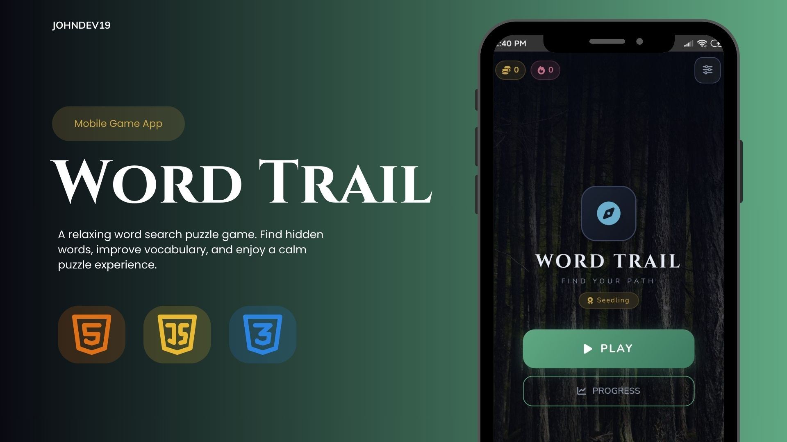
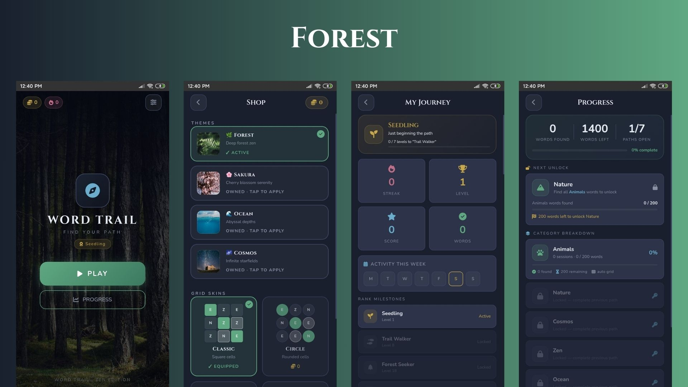
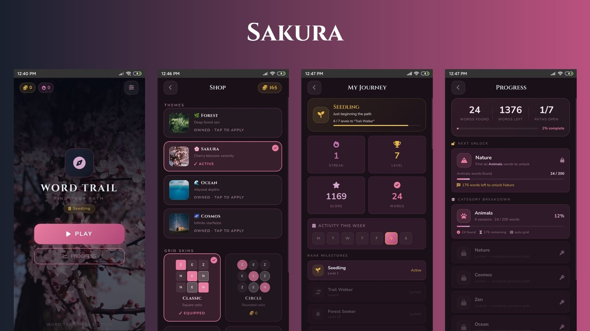
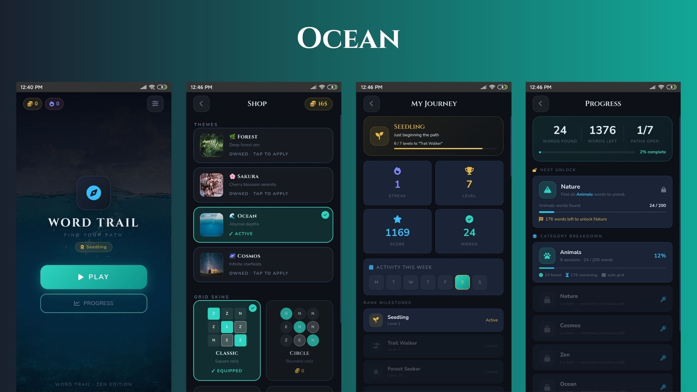
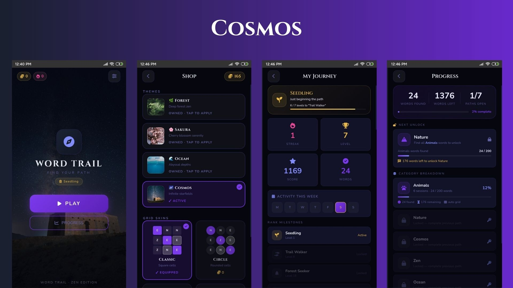
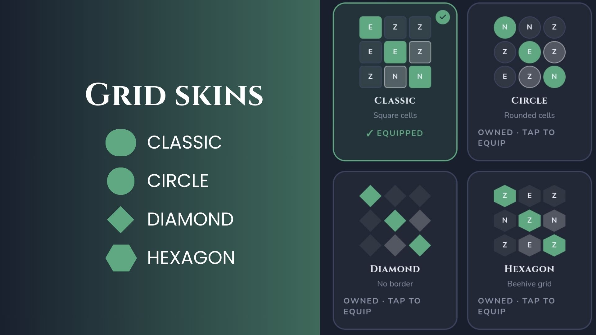
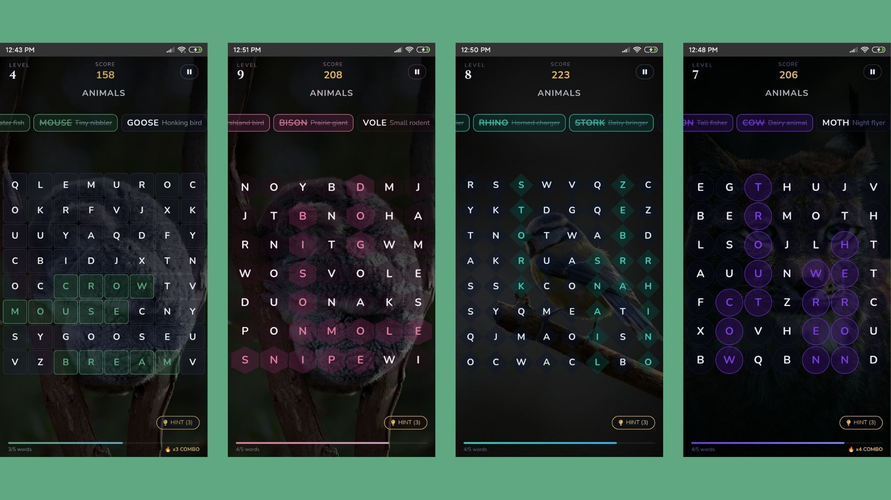

# Word Trail — Zen Word Search Game

A mobile-first word search puzzle game built with vanilla HTML, CSS, and JavaScript.

---

## Features

### Gameplay
- Swipe/drag across the grid to select letters and find hidden words
- Words can be placed horizontally, vertically, diagonally, and in reverse (unlocks as difficulty increases)
- 3 hints per level — highlights the first cell of an unfound word (costs 5 points each)
- Combo system — find words back-to-back to build a combo multiplier
- Score scales with word length and current level

### Difficulty Scaling
- Word count increases as you level up (3 words at Level 1 - up to 10 words at Level 191+)
- New directions unlock at specific levels:
  - Level 1–19: Horizontal and Vertical only
  - Level 20+: Reversed directions added
  - Level 40+: Diagonal directions added
  - Level 65+: All directions enabled
- Word length range increases over time

### Categories (Paths)
There are 7 categories, unlocked in order by exhausting the previous category's word list:
1. Animals
2. Nature
3. Cosmos
4. Zen
5. Ocean
6. Seasons
7. Mystical

### Progression
- 40+ rank titles earned as you level up (Seedling, Trail Walker, Word Sovereign, Infinite Seeker)
- Weekly activity calendar tracks daily play streaks
- Progress screen shows per-category word completion and overall stats

### Shop
- **Themes** — 4 themes available (Forest is free; Sakura, Ocean, Cosmos cost coins)
  - Each theme has its own background images and music track
- **Grid Skins** — 4 skins for grid cell appearance (Classic, Circle, Diamond, Hexagon)

### Audio
- Background music per theme (loops during gameplay)
- Per-category ambient sound effects
- Procedural SFX for: cell selection, dragging, correct/wrong words, combos, hints, level up, purchases
- Music and SFX can be toggled independently in Settings

### Settings
- Toggle: Music, Sound Effects, Vibration, Show Clues (category hints on word chips)
- Reset Progress option (wipes all data back to Level 1)

---

## File Structure

```
/
├── index.html
├── script.js             
├── styles.css
├── assets/
│   ├── css/
│   │   ├── help.css
│   │   ├── unlockcat.css
│   │   └── praise.css
│   ├── js/
│   │   ├── help.js
│   │   ├── unlockcat.js
│   │   ├── wordbank.js 
│   │   └── praise.js
│   ├── sounds/
│   └── images/ 
```

---

## How to Run

No build tools or dependencies required. Just open `index.html` in a browser.

For local development with audio, use a local server (like VS Code Live Server, or `npx serve .`) to avoid browser autoplay restrictions.

---

## Tech Stack

- **HTML5 / CSS3 / Vanilla JavaScript** — no frameworks
- **Web Audio API** — all sound effects are procedurally generated
- **localStorage** — used for save data persistence
- **CSS Grid** — used for the word search grid layout
- **Google Fonts** — Cinzel, Nunito
- **Font Awesome 6** — icons throughout the UI

---







